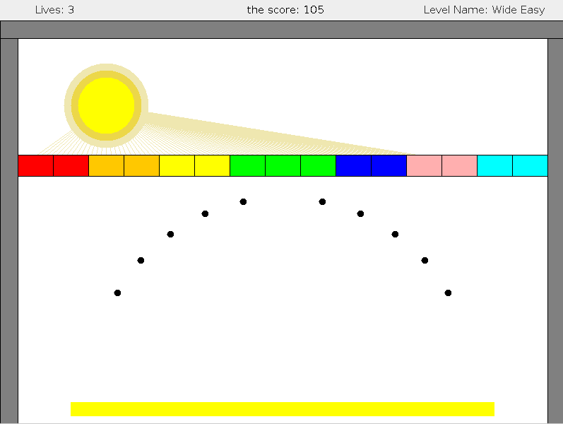

# Arkanoid

This project is a Java implementation of the classic **Arkanoid** game, developed as part of a rolling project for the Object-Oriented Programming (OOP) course at university.

The game demonstrates key OOP principles such as encapsulation, inheritance, polymorphism, and modular design. It features brick-breaking gameplay where the player controls a paddle to bounce a ball and break all the bricks on the screen.



## Features

- Paddle and ball physics
- Multiple brick layouts
- Game-over and win conditions
- Simple, clean object-oriented design

## Running the Game

This project uses [Apache Ant](https://ant.apache.org/) as the build tool.

### Prerequisites

- Java Development Kit (JDK) 8 or higher
- Apache Ant installed and available in your system's `PATH`

### How to Run

1. Unzip the source code:
   ```bash
   unzip src.zip
   cd src
   ```
2. Compile the project using Ant:
   ```bash
   ant
   ```
3. Run the game:
   ```bash
   ant run
   ```

If everything compiles successfully, the game window will open, and you can start playing!
